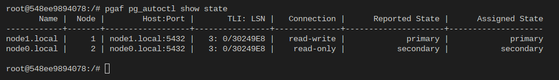

# pg_auto_failover_swarm


Work in progress. Don't use any of this in production (just) yet!

This repository will contain all of the necessary things to have a pg_auto_failover cluster running in Docker Swarm.

## Why?

Running databases in a container orchestrator has one main benefit. You can manage your database cluster in the same way as your application servers.
As pg_auto_failover focuses on ease of use, it made sense to build the orchestration for pg_auto_failover on top of Docker Swarm which also focuses
on simplicity.

# How to use this repository

## Required software

- A recent version of docker-stack-deploy https://github.com/neuroforgede/docker-stack-deploy for automatic secret rotation
- A recent version of nothelm.py https://github.com/neuroforgede/nothelm.py/ for the deployment templating

## Create new environment from scratch (quickstart)

```bash
export BASE_DIR="."
export WORKDIR="$(pwd)/test"
export CHART_DIR="../chart"
export START_PWD=$(pwd)

mkdir -p $WORKDIR/overrides/templates

echo "nothelm run deploy --project-dir $CHART_DIR --project-dir overrides -f values.yaml" > $WORKDIR/setup.sh

cat > $WORKDIR/values.yaml << EOF
stack_name: "pgaf_test"

pgaf_swarm_version: "0.1.2-14"

postgres_nodes:
  - name: "node_1"
    hostname: "node1.local"
    # this is the default, but can be overridden
    pgdata: "/var/lib/postgresql/data"
    # this is the default, but can be overridden
    volume_mount: "/var/lib/postgresql"
    volume_config: {}
    #   name: "node_1"
    #   driver: hetzner-volume
    #   driver_opts:
    #     size: '10'
    #     fstype: ext4
    #     uid: "999"
    #     gid: "999"

  - name: "node_2"
    hostname: "node2.local"
    # this is the default, but can be overridden
    pgdata: "/var/lib/postgresql/data"
    # this is the default, but can be overridden
    volume_mount: "/var/lib/postgresql"
    volume_config: {}
    #   name: "node_2"
    #   driver: hetzner-volume
    #   driver_opts:
    #     size: '10'
    #     fstype: ext4
    #     uid: "999"
    #     gid: "999"

# this is the default, but can be overridden
monitor_node_hostname: "monitor.local"

monitor_node_volume_config: {}
  # driver: hetzner-volume
  # driver_opts:
  #   name: "monitor"
  #   size: '10'
  #   fstype: ext4
  #   uid: "999"
  #   gid: "999"

# this is the default, but can be overridden
monitor_node_pgdata: "/var/lib/postgresql/data"
monitor_node_volume_mount: /var/lib/postgresql

EOF

cp -r "$BASE_DIR/certificates" "$WORKDIR/overrides/templates/certs"
cd "$WORKDIR/overrides/templates/certs"
bash recreate_root_cert.sh
bash recreate_server_certs.sh
```

## Run deployment

```bash
cd $WORKDIR
bash setup.sh
```

# Run pg_autoctl commands

To run `pg_autoctl` commands inside the container, simply prefix the command you want to run with `pgaf`.
### Example: `show state`

To show the state, exec into one of the nodes and run `pgaf pg_autoctl show state`

